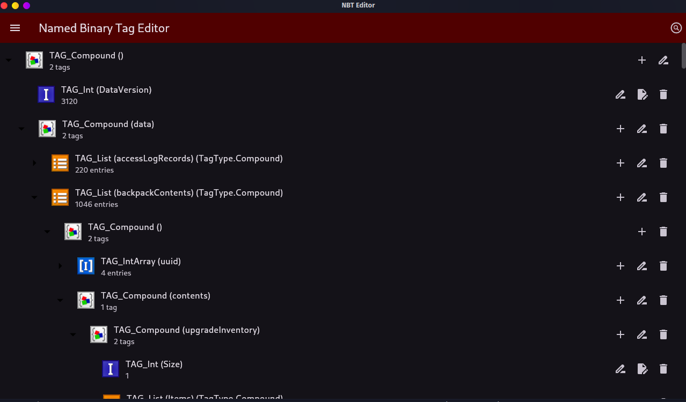

# nbteditor

A fully featured NBT Editor

## Features

- NBT
- SNBT
- GUI

## Build

The following is the build instructions for this project.

# Linux

1. Install Flutter and add it to your path.
2. Run the command: `flutter build linux`

# Windows

1. Install Flutter and add it to your path.
2. Run the command: `flutter build windows`
3. (OPTIONAL) Installer - skip if not desired
4. To build the installer you will need Inno Setup installed.
5. Add the path you installed IS to your path.
6. Run compile.bat to both build and generate the setup file which will be placed into the out folder.
7. Enable Developer Mode if you wish to run the output

# MacOS

1. Install Flutter and add it to your path.
2. Install XCode
3. Install any necessary command line developer tools from XCode
4. Developer mode?
5. Run the command `flutter build macos`

**Testing needed** I do not own a Mac, testing by a Mac user will be required.
